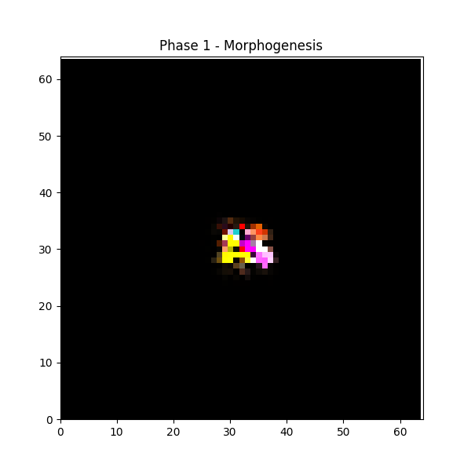
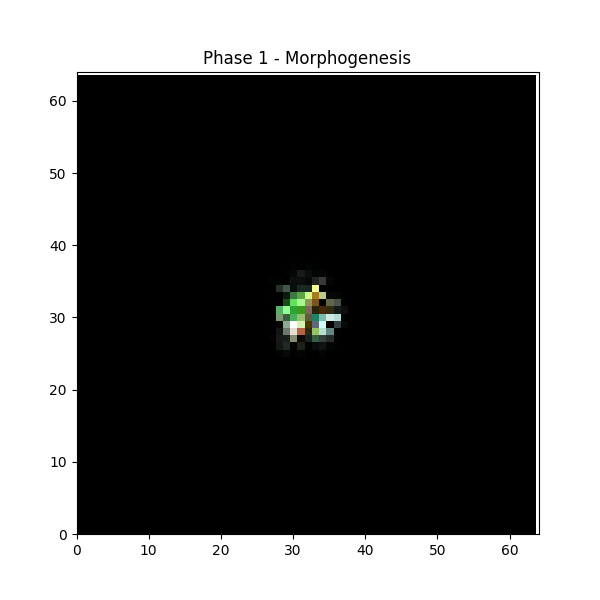
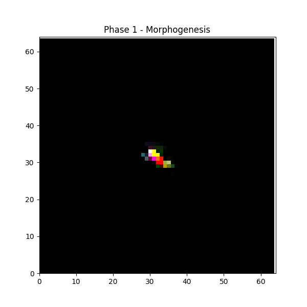

# Motion-Neural-Cellular-Automata
This project, inspired by Distill.pub Grow NCA (https://distill.pub/2020/growing-ca/), wants to reproduce a target image that is able to answer to specific inputs (using GOAL NCA Architecture: https://arxiv.org/pdf/2205.06806) and achieve different goals as Chemotaxis and Random Exploration.

## Demonstrations

Here are some visual results of the trained models across different phases and environments, featuring three different target organisms: Giraffe, Jellyfish, and Salamander.

| Phase / Target | Giraffe | Jellyfish | Salamander |
| :--- | :---: | :---: | :---: |
| **Phase 1: Morphogenesis**<br>Growing from a single seed |  |  |  |
| **Phase 2: Chemotaxis**<br>Moving towards a dynamic goal |  |  |  |
| **Phase 2: Obstacle Avoidance**<br>Repulsive forces and vortex effect |  |  |  |
| **Phase 3: Ecosystem & Mitosis**<br>Random exploration and life cycle |  |  |  |

## Prerequisites

To install all dependencies run:

```bash
pip install -r requirements.txt
```
## Usage

```bash
./run.sh [ACTION] [EXPERIMENT] [TARGET_IMAGE]
```

#### Parameters
- **ACTION**:
  - *train1:* train model for morphogenesis (classic grow NCA behaviour) ;
  - *train2:* train model for pattern motion;
  - *train_all:* train the model for morphogenesis + pattern motion;
  - *inference1:* run model for visualization for target image reproduction;
  - *inference2:* run model for visualization for pattern motion;
- **EXPERIMENT**: Defines the simulation to run
  - *chemotaxis*;
  - *chemotaxis_obs*;
  - *ecosystem*;
- **TARGET_IMAGE**: image path to reproduce

#### Run Example

```bash
./run.sh inference2 chemotaxis targets/salamander32.png
```
## Features

This project implements an advanced Neural Cellular Automata (NCA) model trained in PyTorch, capable of simulating complex biological behaviors across different phases:

* **Morphogenesis (Phase 1):** Training the model to grow a complex shape from a single "seed" (a single active pixel) and stabilize its structure.
* **Chemotaxis and Obstacles (Phase 2):** The generated NCA organisms can move towards a dynamic target. A custom physics engine is implemented, featuring *Attractive Forces* towards the goal, *Repulsive Forces* for intelligent obstacle avoidance (including a tangential "vortex" effect to slide around them), and *Biological Noise* (Brownian Motion) to make the movement more organic and realistic.
* **Ecosystem, Damage, and Mitosis:** Simulation of an autonomous life environment (random exploration). The model is resilient to "slash damage" (structural cuts) and supports fission/mitosis events, where the organism divides and continues to live.
* **Optional Toroidal Physics:** Support for worlds with circular boundaries (donut grid) via configurable circular padding.
* **Visual Inference:** Modules based on `matplotlib.animation` to visualize process simulations (growth, movement, mitosis) in real-time and high quality.
